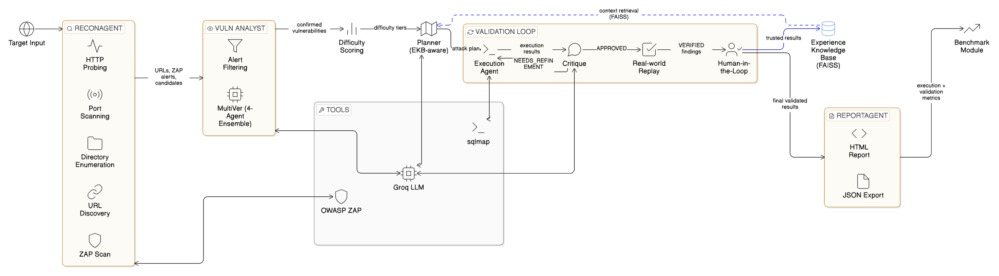

<div align="center">

# AI-Powered Multi-Agent Web Security Tester

### An Autonomous Nine-Stage Penetration Testing Framework

[](https://www.python.org/)
[](https://groq.com/)
[](https://www.zaproxy.org/)
[](https://faiss.ai/)
[](https://www.elastic.co/)
[](LICENSE)

*A nine-stage multi-agent framework that compresses ~200 raw DAST alerts down to 3-8 physically verified findings per scan, with a false-positive rate below 2%.*

</div>

---

## Table of Contents

- [Overview](#overview)
- [Key Results](#key-results)
- [System Architecture](#system-architecture)
- [Pipeline Stages](#pipeline-stages)
- [Project Structure](#project-structure)
- [Prerequisites](#prerequisites)
- [Installation](#installation)
- [Configuration](#configuration)
- [Usage](#usage)
- [SIEM / ELK Stack Setup](#siem--elk-stack-setup)
- [Benchmark Targets](#benchmark-targets)
- [Evaluation Metrics](#evaluation-metrics)
- [Experimental Results](#experimental-results)
- [Safety Bounds](#safety-bounds)
- [Research Context](#research-context)
- [Limitations and Future Work](#limitations-and-future-work)
- [Legal and Ethical Notice](#legal-and-ethical-notice)

---

## Overview

Modern web application security testing faces two compounding problems that most existing tools address in isolation:

1. **Alert Fatigue** — DAST scanners like OWASP ZAP routinely produce 100-200 alerts per scan, of which fewer than 5% are high-confidence actionable findings.
2. **LLM Confirmation Bias** — Generative models interpret ambiguous or partial tool output as confirming vulnerabilities that may not exist.

This framework tackles both problems within a single, cost-bounded pipeline through:

- **MultiVer Four-Agent Ensemble** — Temperature-diversified voting that compresses raw alerts from ~200 to 3-8 confirmed findings per scan
- **Hybrid Critique Gate** — Seven deterministic evidence rules with LLM fallback only for genuinely ambiguous cases
- **Sandbox Validator** — Physically independent replay of every approved finding using real tools (`sqlmap`, `curl`)
- **FAISS-Indexed EKB** — Cross-scan memory that accumulates exploit patterns and grows more accurate over successive runs
- **Human-in-the-Loop (HITL) Gate** — Expert reviewers inject decisions into the EKB with a +0.15 confidence calibration boost, without model retraining

---

## Key Results

Evaluated across **OWASP Juice Shop**, **WebGoat**, and **DVWA** in a controlled local Docker environment.

### Comparative Evaluation Against Baselines

| Metric | ZAP Only | LLM-Only | This Framework |
|--------|----------|----------|----------------|
| Alerts / Run | ~200 | ~15-25 | **~3-8** |
| Alert Reduction Rate (ARR) | 0% | >=85% | **>=96%** |
| False-Positive Rate (FPR) | ~70-80% | ~35-45% | **<2%** |
| Physical Exploit Replay | No | No | **Yes** |

### Per-Target Detection and Validation Results

| Target | Confirmed | Approved | Verified | FPR | EVR | PAV |
|--------|-----------|----------|----------|-----|-----|-----|
| DVWA | 4 | 2 | 1 | 0% | 25% | 50% |
| WebGoat | 4 | 3 | 3 | 0% | 75% | **100%** |
| Juice Shop | 4 | 1 | 0* | 0% | 0%* | 0%* |

> \* XSS on Juice Shop is classified `CONTEXT_UNCERTAIN` — the Angular SPA renders payloads in the browser DOM, inaccessible to the `curl`-based sandbox. This is an architectural constraint, not a missed detection.

### ELK SIEM Critique Verdict Distribution (137 total events)

```
APPROVED          35.04%
REJECTED          45.26%
NEEDS_REFINEMENT  19.71%
```

---

## System Architecture

The framework is a **nine-stage directed pipeline** where every stage presents a typed input contract and a typed output schema, preventing hallucinations from propagating downstream. Inter-agent communication uses Python dictionaries with mandatory named fields; a missing field raises a validation exception rather than a silent failure.



> Target input flows from ReconAgent through VulnAnalyst, CurriculumScorer, and PlannerAgent into the Validation Loop (ExecutionAgent -> Critique -> Sandbox). The FAISS-based EKB provides cross-cutting retrieval and HITL integration; ReportAgent and Benchmark Module produce the final outputs.

---

## Pipeline Stages

```
+-------------------------------------------------------------------+
|          AI-POWERED MULTI-AGENT WEB SECURITY TESTER               |
|                                                                   |
|  [1]  ReconAgent        Nmap + ZAP + URL discovery                |
|  [2]  VulnAnalyst       MultiVer 4-agent ensemble filter          |
|  [2b] CurriculumScorer  CVSS difficulty scoring and ordering      |
|  [3]  PlannerAgent      EKB-aware Plan A/B construction           |
|  [4]  ExecutionAgent    ReAct loop with adaptive retry            |
|  [4b] CritiqueAgent     7 deterministic rules + LLM fallback      |
|  [4c] SandboxValidator  Physical tool replay (sqlmap / curl)      |
|  [5]  HITL Gate         Human review  ->  EKB feedback            |
|  [6]  ReportAgent       HTML + ELK JSON + MITRE ATT&CK mapping    |
+-------------------------------------------------------------------+
```

### Stage Details

| Stage | Agent | Description |
|-------|-------|-------------|
| 1 | **ReconAgent** | HTTP probing, Nmap port/service detection, OWASP ZAP active scanning, directory enumeration, URL discovery |
| 2 | **VulnAnalyst** | MultiVer four-agent ensemble (Security 0.35, Correctness 0.35, Performance 0.15, CVE 0.15). Weighted vote > 0.60 confirms a finding. Ties resolved by temperature-diversified resampling at [0.3, 0.7, 1.0] with 2/3 majority |
| 2b | **CurriculumScorer** | CVSS-derived difficulty score `D = 0.3*AC + 0.2*UI + 0.2*PR + 0.3*ES`; maps to SIMPLE / MEDIUM / COMPLEX tiers |
| 3 | **PlannerAgent** | EKB cosine similarity routing: similarity >= 0.75 triggers Plan B (cached reuse, ~15-20% fewer API calls); below threshold generates Plan A via LLM |
| 4 | **ExecutionAgent** | ReAct loop with adaptive retry escalation, bounded by the 300-second validation window |
| 4b | **CritiqueAgent** | Hybrid Critique Gate: seven deterministic evidence rules evaluated in priority order, LLM fallback (APPROVED / REJECTED / NEEDS_REFINEMENT) only for unresolved cases |
| 4c | **SandboxValidator** | Independent physical replay: `sqlmap` for SQLi, `curl` for header/reflection checks, HTML parser for CSRF. Marks findings VERIFIED or UNVERIFIED |
| 5 | **HITL Gate** | Human review of VERIFIED findings; approved decisions stored in EKB with +0.15 confidence boost for future critique LLM calls on semantically similar patterns |
| 6 | **ReportAgent** | Generates HTML executive report and ELK-compatible NDJSON with MITRE ATT&CK technique annotations |

### Hybrid Critique Gate — Deterministic Evidence Rules

| Rule | Vulnerability | Confirmation Evidence | Confidence |
|------|--------------|----------------------|------------|
| 1 | LFI | `root:x:` or `/bin/bash` in response body | 0.98 |
| 2 | XSS | Unencoded payload reflection in HTTP 200 body | 0.95 |
| 3 | SQLi | `sqlmap` injectable parameter telemetry | 0.97 |
| 4 | Directory Traversal | Directly accessible traversal-path response | — |
| 5 | CSRF | Absence of CSRF token field in state-changing form | — |
| 6 | Clickjacking | Absent `X-Frame-Options` and CSP `frame-ancestors` headers | 0.88 |
| 7 | Misconfiguration | Absent standard security response headers | 0.88 |

---

## Project Structure

```
phase7_fixed/
|
+-- main.py                    # Main orchestrator — runs the full 9-stage pipeline
+-- benchmark.py               # Systematic evaluation across targets and runs
+-- requirements.txt           # Python dependencies
+-- .env                       # API keys (edit before first run)
+-- start_zap.ps1              # PowerShell script to launch OWASP ZAP daemon
+-- START_ZAP.txt              # Step-by-step ZAP + Nmap + ELK startup instructions
+-- diagram.png                # System architecture diagram
|
+-- agents/                    # Core agent implementations (~3,500 lines of Python)
|   +-- recon_agent.py         # Stage 1: Reconnaissance (Nmap + ZAP + URL discovery)
|   +-- vuln_analyst.py        # Stage 2: MultiVer 4-agent ensemble vulnerability filter
|   +-- planner_agent.py       # Stage 3: EKB-aware Plan A/B construction
|   +-- execution_agent.py     # Stage 4: ReAct loop exploit execution
|   +-- critique_agent.py      # Stage 4b: Hybrid Critique Gate
|   +-- report_agent.py        # Stage 6: HTML + ELK JSON + MITRE ATT&CK reporting
|   +-- llm_client.py          # Groq API client with dual-key failover on HTTP 429
|
+-- tools/                     # Security tool wrappers
|   +-- sandbox_validator.py   # Stage 4c: Physical exploit replay (sqlmap / curl)
|   +-- tool_wrappers.py       # ZAP, Nmap, sqlmap, curl, HTTP probe wrappers
|
+-- memory/                    # Persistent experience and scoring
|   +-- ekb.py                 # FAISS-indexed Experience Knowledge Base (384-dim embeddings)
|   +-- ekb_builder.py         # EKB entry construction and storage
|   +-- curriculum_scorer.py   # CVSS-derived difficulty scoring
|   +-- ekb/                   # Persisted FAISS binary index + JSON-serialized metadata
|
+-- config/
|   +-- config.py              # All pipeline configuration (models, safety, targets, EKB, phases)
|
+-- elk-docker/                # SIEM integration
|   +-- docker-compose.yml     # Elasticsearch 8.13.4 + Kibana 8.13.4 + Filebeat 8.13.4
|   +-- filebeat.yml           # Filebeat config — tails reports/live_events.ndjson
|   +-- kibana_dashboard_setup.md
|   +-- README.md
|
+-- reports/                   # Generated outputs (auto-created at runtime)
|   +-- *.html                 # HTML executive reports (per scan)
|   +-- *_elk.json             # ELK-compatible finding summaries (per scan)
|   +-- *.json                 # Full pipeline JSON reports (per scan)
|   +-- benchmark_*.html       # Benchmark HTML reports
|   +-- benchmark_*.json       # Benchmark raw data
|   +-- live_events.ndjson     # Live NDJSON event stream consumed by Filebeat
|
+-- tests/                     # Test stubs
```

---

## Prerequisites

| Requirement | Version | Purpose |
|-------------|---------|---------|
| Python | 3.11+ | Core runtime |
| OWASP ZAP | 2.17.0 | Active DAST scanning |
| sqlmap | 1.10.3 | SQL injection detection and sandbox replay |
| Nmap | 7.x+ | Port and service discovery |
| Docker Desktop | Latest | ELK SIEM stack containers |
| Groq API Key | Free tier | LLM backend (LLaMA-3.3-70B-Versatile, 32K context) |

### Docker Containers for Benchmark Targets

```bash
# DVWA — Damn Vulnerable Web Application (port 9000)
docker run -d -p 9000:80 vulnerables/web-dvwa

# OWASP Juice Shop (port 3000)
docker run -d -p 3000:3000 bkimminich/juice-shop

# WebGoat (port 9001)
docker run -d -p 9001:8080 -p 9090:9090 webgoat/goat-and-wolf
```

---

## Installation

```bash
# 1. Clone the repository
git clone <repository-url>
cd "AI-Powered Multi-Agent Web Security Tester/phase7_fixed"

# 2. Create and activate a virtual environment
python -m venv venv
.\venv\Scripts\Activate.ps1       # Windows PowerShell
# source venv/bin/activate         # Linux / macOS

# 3. Install Python dependencies
pip install -r requirements.txt

# 4. Configure environment variables — see Configuration section below
```

---

## Configuration

### Environment Variables (`.env`)

```env
# Required — get a free key at https://console.groq.com
GROQ_API_KEY=gsk_your_primary_key_here

# Optional — second key for automatic failover on HTTP 429 rate limit responses
GROQ_API_KEY_2=gsk_your_secondary_key_here
```

### Key Settings (`config/config.py`)

```python
# LLM backend — all agents use llama-3.3-70b-versatile via Groq
MODELS = {
    "recon":    {"model": "llama-3.3-70b-versatile", "temperature": 0.1, ...},
    "planner":  {"model": "llama-3.3-70b-versatile", "temperature": 0.2, ...},
    "executor": {"model": "llama-3.3-70b-versatile", "temperature": 0.0, ...},
    ...
}

# Safety bounds — EarlyStopException triggers on any breach
SAFETY = {
    "max_tool_calls":   30,     # Hard cap on total tool invocations per run
    "max_time_seconds": 300,    # Validation loop cap (independent of recon phase)
    "max_cost_usd":     0.30,   # Groq API cost ceiling
}

# Experience Knowledge Base
EKB_SETTINGS = {
    "embedder_model":    "all-MiniLM-L6-v2",  # 384-dimensional sentence embeddings
    "min_similarity":     0.50,
    "plan_b_similarity":  0.75,               # Cosine threshold for Plan B reuse
}

# OWASP ZAP — must be started separately before running main.py in full mode
ZAP_SETTINGS = {
    "host": "localhost",
    "port": 9002,
    "scan_type": "full",   # "passive" or "full"
}
```

---

## Usage

### Step 1 — Start OWASP ZAP (full mode only)

```powershell
# Recommended — use the provided PowerShell script
powershell -ExecutionPolicy Bypass -File .\start_zap.ps1

# Manual alternative
"C:\Program Files\ZAP\Zed Attack Proxy\zap.bat" -daemon -port 9002 `
    -config api.disablekey=true `
    -config api.addrs.addr.name=.* `
    -config api.addrs.addr.regex=true

# Verify ZAP is running: open http://localhost:9002 in a browser
```

> Quick mode does not require ZAP and uses simulated scan data instead.

### Step 2 — Set Nmap Path (Windows, if needed)

```powershell
$env:NMAP_PATH = "E:\AI-Powered Multi-Agent Web Security Tester\nmap\nmap.exe"
```

### Step 3 — Run the Pipeline

```bash
# Full pipeline: Nmap + ZAP active scan + all 9 stages + HITL prompts
python main.py --target http://localhost:9000 --mode full

# Quick mode: skips ZAP, uses simulated scan — no ZAP daemon needed
python main.py --target http://localhost:3000 --mode quick

# WebGoat with path prefix
python main.py --target http://localhost:9001/WebGoat --mode full

# Skip all HITL prompts — useful for automated / CI runs
python main.py --target http://localhost:9000 --mode full --auto-approve
```

### CLI Reference

| Flag | Default | Description |
|------|---------|-------------|
| `--target` | Required | Target URL, e.g. `http://localhost:9000` |
| `--mode` | `quick` | `quick` (no ZAP) or `full` (Nmap + ZAP + all stages) |
| `--auto-approve` | False | Skip HITL review prompts |

### Step 4 — Run Benchmarks

```bash
# Benchmark all three targets, 3 runs each (default)
python benchmark.py

# Quick benchmark — 1 run per target
python benchmark.py --runs 1

# Single target by port number
python benchmark.py --target 9000
```

Benchmark outputs are saved to `reports/benchmark_<timestamp>.html` and `.json`.

---

## SIEM / ELK Stack Setup

Every pipeline step emits a structured NDJSON event to `reports/live_events.ndjson`. Filebeat tails this file and streams events to Elasticsearch, visualised live in Kibana.

### Start the ELK Stack

```bash
# From the project root
cd elk-docker
docker-compose up -d

# Wait approximately 60 seconds, then open Kibana
start http://localhost:5601
```

### Service Endpoints

| Service | Port | Description |
|---------|------|-------------|
| Elasticsearch | 9200 | Event storage, index pattern `websec-tester-YYYY.MM.DD` |
| Kibana | 5601 | Live dashboards and visualisations |
| Filebeat | — | Tails `reports/live_events.ndjson`, ships to Elasticsearch |

### Event Schema (NDJSON)

```json
{
  "@timestamp":  "2026-04-20T08:11:10Z",
  "event_type":  "critique_verdict",
  "step_name":   "SQLi Detection",
  "tool":        "sqlmap",
  "target":      "http://localhost:9000",
  "confidence":  0.97,
  "verdict":     "APPROVED",
  "verified":    true,
  "finding":     "SQL injection at /vulnerabilities/sqli/?id=1"
}
```

### Kibana Dashboard Panels

| Panel | Visualisation | Description |
|-------|--------------|-------------|
| **Event Type Distribution** | Bar chart | Counts per event type: pipeline_complete (~35), analysis_complete (~38), sandbox_validation (~48), critique_verdict (~137) |
| **AI Decision Outcomes** | Donut chart | APPROVED 35.04%, REJECTED 45.26%, NEEDS_REFINEMENT 19.71% |
| **EVR Gauge** | Metric | Live Exploit Validation Rate (last recorded: 66%) |
| **Critique Decisions Table** | Data table | Verdict x category x median confidence score |
| **Validation Results Table** | Data table | `verified=true/false` counts per step type |

Refer to [`elk-docker/kibana_dashboard_setup.md`](elk-docker/kibana_dashboard_setup.md) for full panel configuration instructions.

---

## Benchmark Targets

| Target | Default URL | Stack | Vulnerability Profile |
|--------|------------|-------|----------------------|
| **DVWA** | `http://localhost:9000` | PHP / Apache 2.4.25 | SQLi at `/vulnerabilities/sqli/?id=1` (security=low), XSS at `/xss_r/`, LFI at `/fi/` |
| **OWASP Juice Shop** | `http://localhost:3000` | Node.js / Angular SPA | XSS (DOM-rendered — CONTEXT_UNCERTAIN), SQLi, CORS/CSP misconfigurations |
| **WebGoat** | `http://localhost:9001/WebGoat` | Java / Spring Boot | SQLi (OWASP lesson modules), CSRF (form analysis), Clickjacking, HTTP header checks |

> **Warning:** These are intentionally vulnerable applications for security education and research. Never deploy them on a public or production network.

---

## Evaluation Metrics

| Metric | Abbreviation | Formula | Description |
|--------|-------------|---------|-------------|
| Exploit Validation Rate | **EVR** | `sandbox_verified / execution_steps` | Proportion of executed steps that yield a physically verified exploit |
| Precision After Validation | **PAV** | `sandbox_verified / critique_approved` | Proportion of approved findings confirmed by independent replay |
| False Positive Rate | **FPR** | Manual review | Critique-approved findings rejected by sandbox or HITL reviewer |
| Alert Reduction Rate | **ARR** | `1 - (N_confirmed / N_raw)` | Noise suppression from raw DAST alerts to ensemble-confirmed findings |
| Pipeline Strictness Gap | **PSG** | `confirmed - sandbox_verified` | Gap between analyst-confirmed and physically verified findings |

### Curriculum Difficulty Scoring

```
D = 0.3 * AC  +  0.2 * UI  +  0.2 * PR  +  0.3 * ES
```

AC = Attack Complexity, UI = User Interaction, PR = Privilege Requirements, ES = Exploitability Score (CVSS v3)

| D Score | Tier |
|---------|------|
| D < 0.30 | SIMPLE |
| 0.30 <= D < 0.60 | MEDIUM |
| D >= 0.60 | COMPLEX |

---

## Experimental Results

> **Scope note:** Results are from a controlled local environment with three intentionally vulnerable benchmark applications and are indicative of framework behaviour rather than statistically definitive guarantees.

### Full Research Metrics Across All Targets

| Metric | DVWA | WebGoat | Juice Shop | Goal |
|--------|------|---------|------------|------|
| EVR | 25% | **75%** | 0% (SPA constraint) | >=50% |
| PAV | 50% | **100%** | N/A (SPA constraint) | >=80% |
| FPR | **0%** | **0%** | **0%** | <2% |
| PSG | 3 | 1 | 4 | <=2 |
| ARR | 98% | 99% | 98.5% | >=95% |
| Scan Time | 286 s | 259 s | 482 s** | <300 s |

> \*\* The 482 s Juice Shop total includes the ZAP recon phase. The 300-second EarlyStopException cap governs only the validation loop (Stages 4-4c).

### Critique Verdict Distribution (137 events across all runs)

| Verdict | Approx. Count | Percentage |
|---------|--------------|-----------|
| APPROVED | ~48 | 35.04% |
| REJECTED | ~62 | 45.26% |
| NEEDS_REFINEMENT | ~27 | 19.71% |

### Critique Confidence Scores by Category

| Category | Verdict | Records | Median Confidence |
|----------|---------|---------|-------------------|
| SQLi Detection | APPROVED | 16 | **0.97** |
| XSS Test | APPROVED | 11 | 0.92 |
| SQLi Exploitation | NEEDS_REFINEMENT | 10 | 0.70 |
| Misconfiguration | APPROVED | ~10 | 0.88 |

### Sandbox Validation Results

| Step Type | Verified | Records |
|-----------|---------|---------|
| SQLi Detection | true | 16 |
| Misconfiguration Test | true | 10 |
| XSS Test | false (SPA constraint) | 11 |

---

## Safety Bounds

Three hard limits trigger an `EarlyStopException` when breached, preventing runaway LLM loops from accumulating cost or executing destructive payloads:

| Bound | Limit | Scope |
|-------|-------|-------|
| API Cost | $0.30 USD | Per scan total |
| Execution Time | 300 seconds | Validation loop only (Stages 4-4c); recon is excluded |
| Tool Calls | 30 calls | Per pipeline run |

Additional safety mechanisms:

- **Dual API key rotation** — automatic failover to `GROQ_API_KEY_2` on HTTP 429 responses
- **Allowlist enforcement** — `SAFETY.allowed_targets_only = True` prevents targeting production systems
- **HITL approval required** for: `sql_injection_write`, `file_upload_exploit`, `reverse_shell`, `privilege_escalation`

---

## Research Context

This repository is the implementation artefact for an unpublished research paper:

> **"AI-Powered Multi-Agent Framework for Autonomous Web Application Penetration Testing"**
>
> V. Parvez Thabarak, A. Bharath Kumar Reddy, Dr. S. Thanga Revathi
> Department of Networking and Communications, SRM Institute of Science and Technology, Kattankulathur, Chennai, India

### Key Architectural Contributions

1. **Hallucination suppression without fine-tuning** — deterministic evidence rules handle the majority of findings; the LLM fallback is invoked only for genuinely ambiguous cases.
2. **Physically independent confirmation** — the Sandbox Validator re-invokes security tools in full isolation from all prior LLM inference, eliminating in-context confirmation bias.
3. **Progressive cross-scan learning** — the FAISS-indexed EKB stores 384-dimensional `all-MiniLM-L6-v2` embeddings of exploit outcomes, enabling Plan B reuse and HITL-driven calibration without gradient-based model updates.
4. **Cost-bounded autonomy** — three hard safety limits keep each scan within a $0.30 API budget and a 30 tool-call ceiling.

### Comparison With Prior Systems

| System | Key Mechanism | Gap Addressed by This Work |
|--------|--------------|---------------------------|
| Co-RedTeam (Google, 2025) | ReAct loops, adaptive retry | No independent replay, no cross-scan memory |
| MAPTA (UCL, 2025) | End-to-end exploit validator | Validates in same execution context (in-context bias risk) |
| CurriculumPT (Beijing Jiaotong, 2025) | CVSS-guided task scheduling | LLM self-assessment only, no physical replay |
| PentestMCP (Harbin UST, 2025) | Tools as typed MCP functions | No persistent cross-scan memory |
| PENTEST-AI (2024) | MITRE ATT&CK annotations | No ensemble pre-filtering, no EKB |

---

## Limitations and Future Work

### Current Limitations

- **Benchmark scope** — three intentionally vulnerable training applications; production targets present far more varied stacks and authentication schemes.
- **Sample size** — API rate limits prevented the 10+ independent runs per target needed for statistically bounded reporting.
- **SPA constraint** — DOM-based XSS, stored XSS, and vulnerabilities requiring JavaScript execution cannot be confirmed by the `curl`-based sandbox.
- **Ensemble weights** — the 0.60 threshold and agent weights were selected through design reasoning, not empirical search on a held-out set.

### Future Directions

1. **Headless Chromium sandbox** (Playwright / Puppeteer) for DOM-based and stored XSS verification
2. **Nmap NSE integration** to map detected service versions to CVSS-scored CVE identifiers at the planning stage
3. **Longitudinal EKB evaluation** across 10+ successive scans to quantify plan-reuse EVR improvement
4. **Automated attack chaining** — carry confirmed SQLi credentials into downstream authentication bypass steps
5. **Comparative evaluation** against Nikto, Nuclei, and commercial DAST platforms on a shared reproducible benchmark

---

## Legal and Ethical Notice

> **This framework is intended exclusively for authorized security testing on systems you own or have explicit written permission to test.**
>
> Running active scans or exploit payloads against systems without authorization is illegal under the Computer Fraud and Abuse Act (CFAA), the Computer Misuse Act, and equivalent statutes in most jurisdictions. The authors and their institution accept no liability for any misuse of this software.
>
> All benchmark targets used in this research are intentionally vulnerable applications deployed in isolated, offline Docker environments with no external network access.

---
